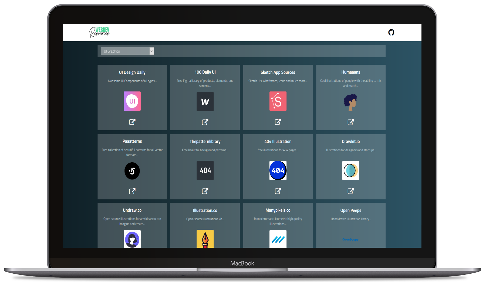

  

## Design Resources For Web Developers 😉

> _list of design and UI resources from stock photos, web templates, CSS frameworks, JS framewroks, React frameworks, Vue and Angular frameworkds, UI libraries, Font, Font-Icons, Icons, Mockups, Online Design tool and much more..._

## Link 🚀

http://resources.gurupawar.info

## Table of Contents 🧾

- UI Graphics
- Fonts
- Colors
- Icons
- Favicons
- Icon Fonts
- Stock Photos
- Stock Videos
- Stock Music & Sound Effects
- Vectors & Clipart
- Product & Image Mockups
- HTML & CSS Templates
- CSS Frameworks
- CSS Animations
- Javascript Animations
- UI Components & Kits
- React UI Libraries
- Vue UI Libraries
- Angular UI Libraries
- Svelte UI Libraries
- Design Systems & Style Guides
- Online Design Tools
- Downloadable Design Software
- Design Inspiration
- Image Compression
- Others

## API Used from api.theindex.tech ⚡️

[API](https://api.theindex.tech/)

## Give a Star ⭐️ if you liked it ⚡️

If you want to contribute, feel free to make a Pull Request. ☘️☘️

## License📜

This project is licensed under the [MIT License](https://opensource.org/licenses/MIT) - see the [LICENSE](LICENSE) file for details.
